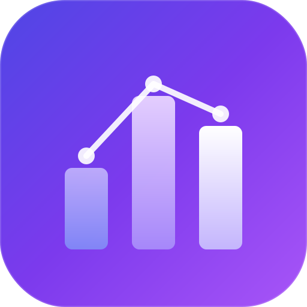
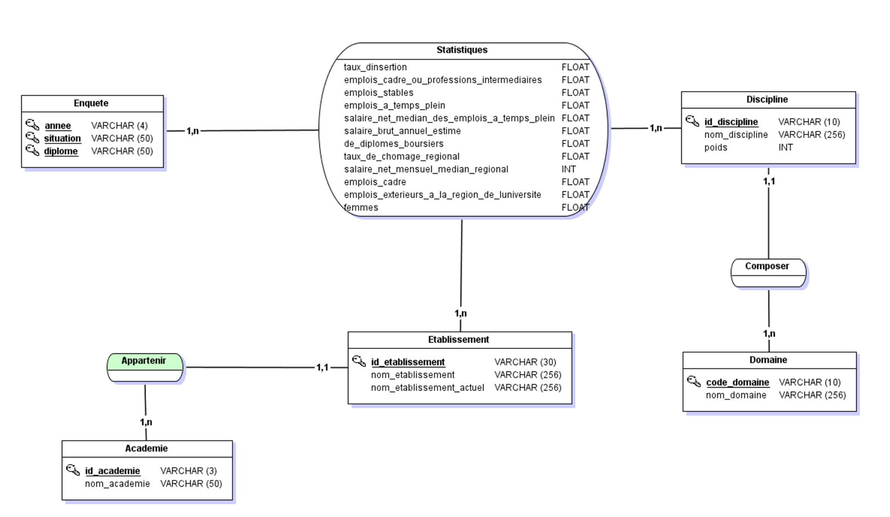
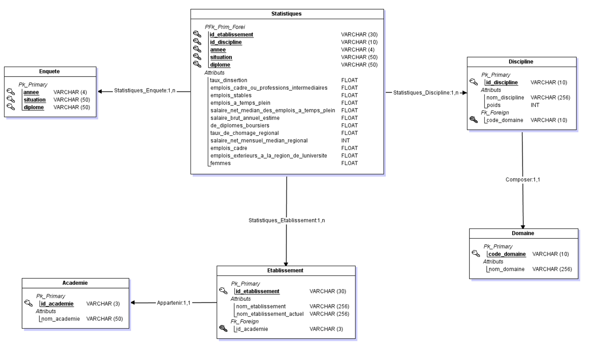

<p align="center">
  <a href="https://github.com/toufik-ferhat/prodataviz">
    
  </a>
</p>

<h1 align="center">ProDataViz</h1>

<p align="center">
  <strong>Plateforme d'analyse interactive &amp; environnement d'apprentissage SQL pour les données d'insertion professionnelle des diplômés de Master en France (2010 – 2020).</strong>
</p>

<p align="center">
  <a href="#-lancement-rapide"></a>&nbsp;
  <a href="README.md"></a>
</p>

<p align="center">
  
  
  
  
  
  
  
</p>

---

## Pourquoi ProDataViz ?

La plupart des outils d'apprentissage SQL utilisent des jeux de données fictifs. **ProDataViz** exploite de **vraies données ouvertes** — plus de 100 000 enregistrements provenant de [data.gouv.fr](https://data.gouv.fr) couvrant les salaires, taux d'insertion et parcours professionnels des diplômés universitaires français — pour créer une plateforme d'analyse et d'éducation de niveau professionnel.

<table>
<tr>
<td width="50%">

### 📊 Suite Analytique
- **Dashboard** — Cartes KPI, évolution des salaires, répartition par discipline
- **Explorateur** — Table paginée avec filtres dynamiques sur 100k+ données
- **Classements** — Top universités par salaire et taux d'insertion
- **Comparer** — Graphique radar pour comparer jusqu'à 5 universités

</td>
<td width="50%">

### 🎓 Apprentissage SQL
- **Apprendre SQL** — 10 leçons interactives du SELECT aux fonctions de fenêtrage
- **SQL Lab** — Éditeur Monaco, navigateur de schéma, plans EXPLAIN, score de complexité
- **20 Défis** — Exercices progressifs gamifiés avec correction automatique et visualisations

</td>
</tr>
</table>

---

## 🖥️ Captures d'écran

> **Interface dark glassmorphique** — design responsive et premium avec effets de flou, accents dégradés et animations fluides.

| Dashboard | SQL Lab | Défis |
|:---------:|:-------:|:-----:|
|  |  | *Bientôt* |

---

## 🏗️ Architecture

```
prodataviz/
├── backend/                 # API REST FastAPI
│   ├── app/
│   │   ├── models.py        # 7 modèles SQLAlchemy (3NF)
│   │   ├── crud.py          # Couche requêtes
│   │   ├── schemas.py       # Validation Pydantic
│   │   └── routers/         # academies, analytics, sql_lab, statistiques
│   └── scripts/seed.py      # Pipeline ETL CSV → SQLite
├── frontend/                # Next.js 16 (App Router)
│   ├── app/[locale]/        # Pages i18n (fr / en)
│   │   ├── page.js          # Dashboard
│   │   ├── explorer/        # Explorateur de données
│   │   ├── classements/     # Classements
│   │   ├── comparer/        # Comparateur d'universités
│   │   ├── apprendre-sql/   # Cours SQL en 10 leçons
│   │   ├── sql-lab/         # Éditeur SQL complet
│   │   └── defis/           # 20 défis gamifiés
│   ├── components/          # Composants UI partagés
│   ├── lib/api.js           # Client API backend
│   └── messages/            # Fichiers de traduction i18n
├── data/                    # Jeu de données CSV + JSON
├── docs/                    # Architecture BDD & guide SQL
└── start.sh                 # Lanceur en une commande
```

### Stack Technique

| Couche | Technologie | Rôle |
|--------|------------|------|
| **Frontend** | Next.js 16, React 19 | App Router, SSR, routage i18n |
| **Éditeur** | Monaco Editor | Édition SQL niveau VS Code |
| **Graphiques** | Chart.js + react-chartjs-2 | Visualisations Bar, Line, Radar, Doughnut |
| **i18n** | next-intl | Français / Anglais transparent |
| **Backend** | FastAPI, SQLAlchemy 2.0 | API REST asynchrone, ORM |
| **Base de données** | SQLite (3NF, 7 tables) | Schéma relationnel normalisé |
| **Design** | CSS sur mesure (Glassmorphism) | Thème sombre premium, responsive |
| **Outillage** | uv, npm | Gestion rapide des dépendances |

### Schéma de la Base (3NF)

```
academie ─┬─ etablissement ──┬── statistique ──┬── enquete
           │                  │                 │
           └──────────────────┘   discipline ───┘
                                       │
                                   domaine

           donnees_nationales (table agrégée indépendante)
```

7 tables, entièrement normalisées en troisième forme normale. Voir [docs/architecture.md](docs/architecture.md) pour l'ERD complet et la stratégie d'indexation.

---

## 🚀 Lancement Rapide

### Prérequis

| Outil | Version | Installation |
|-------|---------|-------------|
| Python | 3.12+ | [python.org](https://python.org) |
| uv | dernière | `curl -LsSf https://astral.sh/uv/install.sh \| sh` |
| Node.js | 20+ | [nodejs.org](https://nodejs.org) |

### Option A : Lancement en une commande

```bash
# Cloner le dépôt
git clone https://github.com/toufik-ferhat/prodataviz.git
cd prodataviz

# Installer, alimenter la BDD et lancer les deux serveurs
chmod +x start.sh && ./start.sh
```

### Option B : Installation manuelle

<details>
<summary><strong>Instructions pas-à-pas</strong></summary>

#### 1. Backend

```bash
cd backend

# Installer les dépendances
uv sync

# Alimenter la base SQLite depuis le CSV (~2s)
uv run scripts/seed.py

# Lancer le serveur API sur le port 8000
uv run app/main.py
```

#### 2. Frontend (nouveau terminal)

```bash
cd frontend

# Installer les dépendances
npm install

# Lancer le serveur de développement sur le port 3000
npm run dev
```

</details>

Ouvrez **[http://localhost:3000](http://localhost:3000)** et commencez à explorer !

---

## 🎯 Fonctionnalités en Détail

### Apprentissage SQL Interactif (10 Leçons)

Un parcours structuré de zéro à avancé, utilisant le vrai jeu de données ProDataViz :

| # | Sujet | Concepts Clés |
|---|-------|--------------|
| 1 | `SELECT` | Choix de colonnes, `FROM`, `*` |
| 2 | `WHERE` | Filtrage, opérateurs de comparaison, `LIKE`, `AND`/`OR` |
| 3 | `ORDER BY` & `LIMIT` | Tri, pagination, `ASC`/`DESC` |
| 4 | Agrégats | `COUNT`, `SUM`, `AVG`, `MIN`, `MAX` |
| 5 | `GROUP BY` | Regroupement, agrégation par catégorie |
| 6 | `HAVING` | Filtrage des groupes post-agrégation |
| 7 | `JOIN` | `INNER JOIN`, mise en relation de tables |
| 8 | JOINs multi-tables | 3+ tables, relations complexes |
| 9 | Sous-requêtes | `SELECT` imbriqués, `IN`, corrélés |
| 10 | Fonctions de fenêtrage | `ROW_NUMBER`, `RANK`, `LAG`, `OVER` |

Chaque leçon comprend une **théorie**, une **référence syntaxique**, un **exemple interactif en direct** et un **exercice pratique** avec système d'indices et vérification automatique.

### Défis SQL (20 Exercices)

Trois niveaux de difficulté avec correction automatique :

- ⭐ **Débutant (1–5)** — `SELECT`, `WHERE`, `ORDER BY`, `COUNT`, `MAX`
- ⭐⭐ **Intermédiaire (6–10)** — `JOIN`, `GROUP BY`, `HAVING`, `CASE WHEN`, sous-requêtes
- ⭐⭐⭐ **Avancé (11–15)** — `RANK()`, `LAG()`, `ROW_NUMBER()`, CTE, requêtes complexes
- 📊 **Visualisation (16–20)** — Défis produisant des graphiques **Bar, Line, Doughnut et Multi-line**

### SQL Lab

Un atelier SQL complet :

- **Éditeur Monaco** avec coloration syntaxique SQL
- **Navigateur de schéma** — cliquez pour explorer les 7 tables et colonnes
- **EXPLAIN Query Plan** — visualisez les plans d'exécution SQLite
- **Score de complexité** — analyse en temps réel de l'efficacité des requêtes
- **Table de résultats** — résultats paginés avec temps d'exécution

---

## 🌐 Internationalisation

Support complet français et anglais grâce à `next-intl` :

- Routage par locale dans l'URL (`/fr/...`, `/en/...`)
- Tout le texte de l'interface externalisé dans des fichiers JSON
- Sélecteur de langue dans la barre latérale
- Contenu des leçons SQL disponible dans les deux langues

---

## 📚 Documentation

| Document | Description |
|----------|-------------|
| [Architecture de la BDD](docs/architecture.md) | ERD, justification 3NF, stratégie d'indexation |
| [Guide SQL & Défis](docs/sql_guide.md) | Les 20 défis avec solutions |

---

## 🤝 Contribuer

Les contributions sont les bienvenues ! Voici comment :

1. **Forkez** le dépôt
2. **Créez** une branche feature (`git checkout -b feature/super-fonctionnalité`)
3. **Committez** vos changements (`git commit -m 'Ajout super fonctionnalité'`)
4. **Pushez** la branche (`git push origin feature/super-fonctionnalité`)
5. **Ouvrez** une Pull Request

---

## 📄 Licence

Ce projet est sous licence MIT — voir le fichier [LICENSE](LICENSE) pour plus de détails.

---

## 👥 Auteurs

<table>
<tr>
<td align="center"><strong>Toufik FERHAT</strong></td>
<td align="center"><strong>Asma DAGMOUNE</strong></td>
</tr>
</table>

> Projet universitaire — Systèmes d'Information

---

<p align="center">
  <strong>Source des données :</strong> <a href="https://data.gouv.fr">data.gouv.fr</a> — portail open data du gouvernement français
</p>

<p align="center">
  <sub>Construit avec ❤️ en utilisant Next.js, FastAPI, Chart.js &amp; Monaco Editor</sub>
</p>
