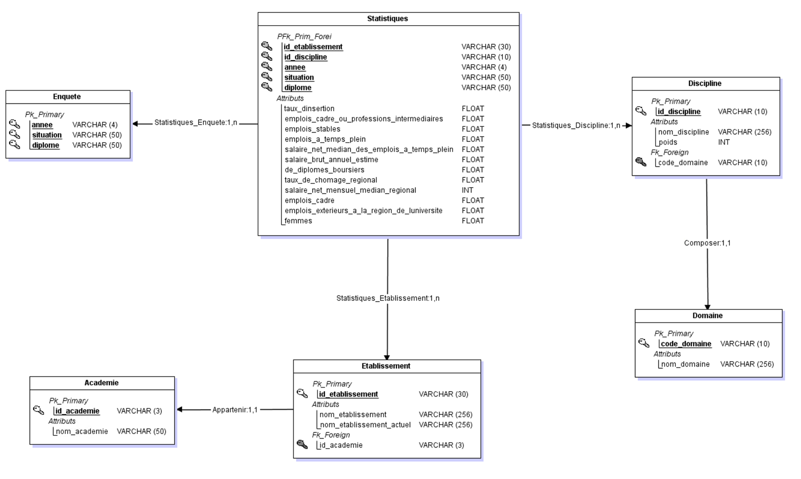

# ProDataViz

This project have been done as part of an academic project for the course [Génié logiciel et big data](https://moodle-sciences.upmc.fr/moodle-2021/course/view.php?id=4001) in the second year of 
master studies on Smart Systems Engineering at Sorbonne Université.

## Project
This project aims to create a web application that will be used to visualize the data of professional integration of master students in france.
### Data
The brut data are collected from [Data.gouv.fr](https://www.data.gouv.fr/fr/datasets/insertion-professionnelle-des-diplomes-de-master-en-universites-et-etablissements-assimil-0/) as 
csv file with almost 15000 rows and more than 30 columns.

### Cleaning
The data are preprocessed to remove the useless columns and rows using 
pandas.

### Storage
The cleaned data are stored in a MySQL database.

### Database
The database is created with the following logical schema:

## Team

