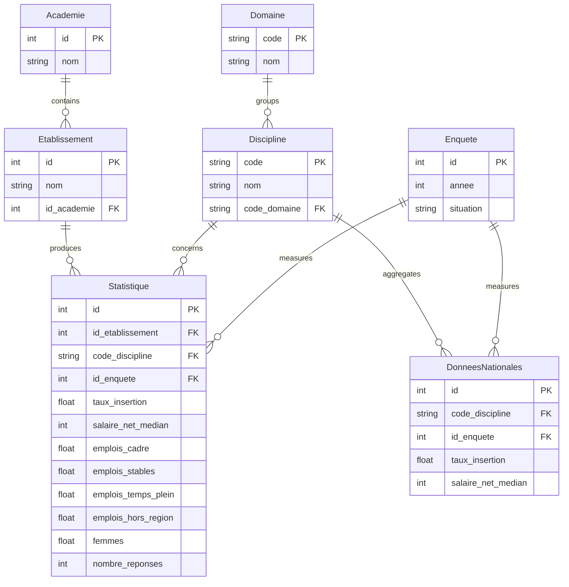

# Database Architecture (ProDataViz)

> 🇫🇷 [Version française ci-dessous](#-architecture-de-la-base-de-données-prodataviz)

ProDataViz is built on a normalized relational architecture (3NF) specifically designed to ensure data integrity while delivering excellent performance for the analytics dashboard and the interactive SQL learning tool.

## 📊 Entity-Relationship Diagram (ERD)



---

## 🏗️ Data Model Justification (Third Normal Form — 3NF)

The source JSON dataset ("fr-esr-insertion_professionnelle-master.json") is **completely denormalized**. Each record repeats academy names, institution names, domain names, and discipline names (redundancy factor of 100+).

To comply with academic standards and relational database best practices, we split the dataset into **7 separate tables**:

### 1. Geographic Dimension
- **`Academie`** (Academy): Isolated to avoid repeating long academy names (e.g. "Clermont-Auvergne").
- **`Etablissement`** (Institution): Depends on the academy. Enables ultra-fast first-level filtering on the frontend.

### 2. Educational Dimension
- **`Domaine`** (Domain, e.g. "Sciences, technologies et santé"): The highest level of educational granularity.
- **`Discipline`** (e.g. "disc16" — Computer Science): Attached to a domain. Users typically filter by discipline; isolating these keys allows populating dropdown menus (`SELECT nom FROM discipline`) in milliseconds.

### 3. Temporal & Context Dimension
- **`Enquete`** (Survey): Builds an implicit composite PK (Year + Situation, e.g. "2018" + "30 months after graduation"). Isolating the survey ensures that a single typo in the source JSON won't corrupt the dashboard's temporal dimension.

### 4. Fact Tables (Statistics)
- **`Statistique`**: The central fact table. It contains **no heavy text strings** beyond its foreign keys (id_etablissement, code_discipline, id_enquete) and pure numeric indicators (salaries, rates, counts).
- **`DonneesNationales`** (National Data): A separate table for national-level aggregation, since it doesn't depend on any specific institution but follows the same time and subject dimensions.

---

## ⚡ Indexing Strategy for Real-Time Dashboards

ProDataViz dashboards display aggregated metrics on multi-year university performance. Complex queries with multiple `JOIN`s are executed across approximately **20,000 rows**.

To guarantee response times under `50ms` and ensure the SQL Lab grading algorithm responds favorably (grade "A" with `USES INDEX`):

1. **Composite Index on the Fact Table**:
   ```sql
   CREATE INDEX ix_statistique_recherche 
   ON statistique(id_etablissement, code_discipline, id_enquete);
   ```
   **Why?** Guarantees ultra-optimized lookups when Explorer users filter simultaneously by University, Year, and Discipline.

2. **Sorting Indexes**:
   ```sql
   CREATE INDEX ix_stat_salaire ON statistique (salaire_net_median DESC);
   CREATE INDEX ix_stat_insertion ON statistique (taux_insertion DESC);
   ```
   **Why?** Used to compute the "Rankings" section (Top 10 or Radar) without executing a costly in-memory sort (`TEMP B-TREE`). SQLite reads the index naturally in descending order.

3. **Indexed Foreign Keys**:
   Every FK in the `Statistique` table is natively indexed by SQLAlchemy to optimize joins in the "SQL Lab" page.

---

## 🧩 FastAPI-Side Modeling (Pydantic & SQLAlchemy)
- SQLAlchemy models (`models.py`) use `relationship(back_populates="...")`, enabling the Python backend to process data as object graphs (Lazy Loading or Joined Loading) before serialization.
- Pydantic models (`schemas.py`) filter the attributes returned to the frontend and ensure correct casting of floats and strings.

---
---

# 🇫🇷 Architecture de la Base de Données (ProDataViz)

L'application ProDataViz repose sur une architecture relationnelle normalisée (3NF) conçue spécifiquement pour garantir l'intégrité des données tout en offrant d'excellentes performances pour le tableau de bord analytique et l'outil d'apprentissage SQL interactif.

## 📊 Diagramme Entité-Relation (ERD)

```mermaid
erDiagram
    Academie {
        int id PK
        string nom
    }
    
    Etablissement {
        int id PK
        string nom
        int id_academie FK
    }
    
    Domaine {
        string code PK
        string nom
    }
    
    Discipline {
        string code PK
        string nom&
        string code_domaine FK
    }
    
    Enquete {
        int id PK
        int annee
        string situation
    }
    
    Statistique {
        int id PK
        int id_etablissement FK
        string code_discipline FK
        int id_enquete FK
        float taux_insertion
        int salaire_net_median
        float emplois_cadre
        float emplois_stables
        float emplois_temps_plein
        float emplois_hors_region
        float femmes
        int nombre_reponses
    }
    
    DonneesNationales {
        int id PK
        string code_discipline FK
        int id_enquete FK
        float taux_insertion
        int salaire_net_median
    }

    Academie ||--o{ Etablissement : "contient"
    Domaine ||--o{ Discipline : "regroupe"
    Etablissement ||--o{ Statistique : "produit"
    Discipline ||--o{ Statistique : "concerne"
    Enquete ||--o{ Statistique : "mesure"
    Discipline ||--o{ DonneesNationales : "agrège"
    Enquete ||--o{ DonneesNationales : "mesure"
```

---

## 🏗️ Justification de la Modélisation (Troisième Forme Normale — 3NF)

Le dataset source JSON (« fr-esr-insertion_professionnelle-master.json ») est **complètement dénormalisé**. Chaque enregistrement répète les noms d'académies, d'établissements, de domaines et de disciplines (redondance d'un facteur 100+). 

Afin de respecter les règles académiques et pratiques des SGBD relationnels, nous avons découpé le set de données en **7 tables séparées** :

### 1. Dimension Géographique
- **`Academie`** : Isolé pour éviter la répétition du nom long de l'académie (ex: "Clermont-Auvergne").
- **`Etablissement`** : Dépend de l'académie. Cela permet un filtrage de premier niveau ultra-rapide côté front-end.

### 2. Dimension Pédagogique
- **`Domaine`** (ex: "Sciences, technologies et santé") : La plus haute granularité d'apprentissage.
- **`Discipline`** (ex: "disc16" — Informatique) : Rattachée à un domaine. Les utilisateurs filtrent généralement par discipline, isoler ces clés permet de populer les menus déroulants (`SELECT nom FROM discipline`) en quelques millisecondes.

### 3. Dimension Temporelle & Contexte
- **`Enquete`** : Construit une PK composite implicite (Année + Situation, ex: "2018" + "30 mois après le diplôme"). Isoler l'enquête garantit qu'une simple faute de frappe dans le JSON source ne corrompt pas la dimension temporelle du Dashboard.

### 4. Tables de Faits (Statistiques)
- **`Statistique`** : La table centrale (Fact Table). Elle ne contient **aucune chaîne de caractères lourde** hormis ses clés étrangères (id_etablissement, code_discipline, id_enquete) et de purs indicateurs numériques (salaires, taux, effectifs). 
- **`DonneesNationales`** : Table séparée pour l'agrégation nationale, car elle ne dépend d'aucun établissement spécifique mais obéit aux mêmes dimensions de temps et de matière.

---

## ⚡ Stratégie d'Indexation pour Dashboard Temps Réel

Les tableaux de bord de ProDataViz affichent des métriques agrégées sur l'évolution triennale des universités. Des requêtes complexes avec de multiples `JOIN` sont exécutées sur environ **20 000 lignes**.

Pour garantir des temps de réponse inférieurs à `50ms` et s'assurer que l'algo du SQL Lab réponde favorablement (grade "A" avec `USES INDEX`) :

1. **Index Composite sur la Table de Faits** :
   ```sql
   CREATE INDEX ix_statistique_recherche 
   ON statistique(id_etablissement, code_discipline, id_enquete);
   ```
   **Pourquoi ?** Garantit une recherche ultra-optimisée lorsque l'utilisateur de l'Explorer filtre à la fois par Université, Année et Discipline.

2. **Index Triés (Sorting Indexes)** :
   ```sql
   CREATE INDEX ix_stat_salaire ON statistique (salaire_net_median DESC);
   CREATE INDEX ix_stat_insertion ON statistique (taux_insertion DESC);
   ```
   **Pourquoi ?** Utilisé pour calculer la section "Classements" (Top 10 ou Radar) sans devoir exécuter un coûteux tri en mémoire (`TEMP B-TREE`). SQLite lit l'index naturellement de manière descending.

3. **Clés Étrangères Indexées** :
   Chaque FK de la table `Statistique` est nativement indexée par SQLAlchemy pour optimiser les jointures de la page "SQL Lab".

---

## 🧩 Modélisation Côté FastAPI (Pydantic & SQLAlchemy)
- Les modèles SQLAlchemy (`models.py`) utilisent `relationship(back_populates="...")`, ce qui permet au backend Python de traiter les données sous forme de graphes d'objets (Lazy Loading ou Joined Loading) avant de les sérialiser.
- Les modèles Pydantic (`schemas.py`) filtrent les attributs renvoyés au front et assurent le cast correct des valeurs flottantes et des chaînes.
